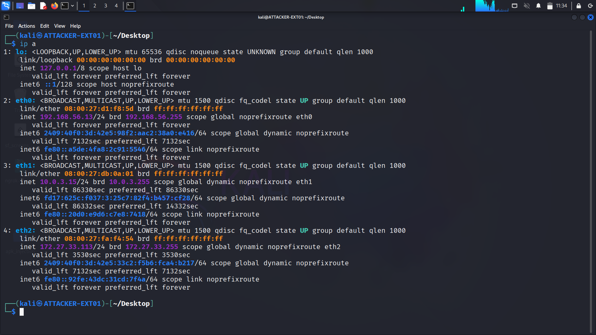
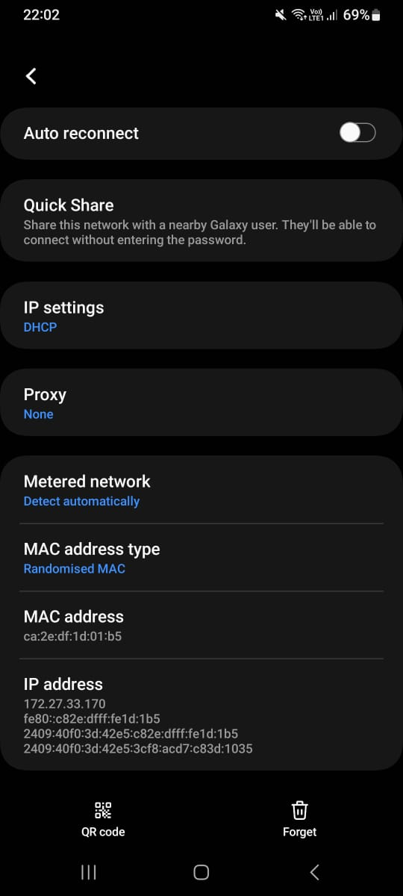
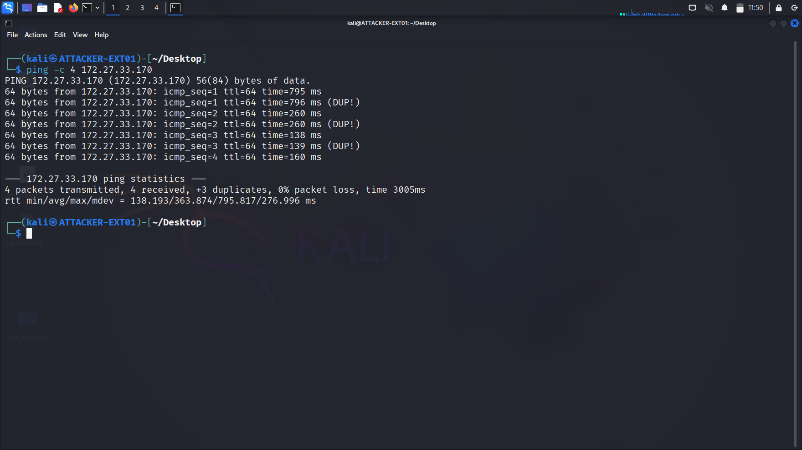
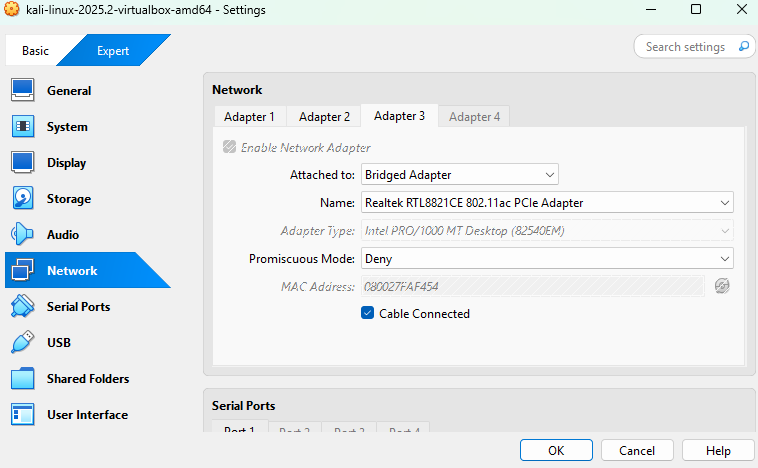

# Environment Setup

This section documents the network configuration and tool installation required for the Android Meterpreter embedding lab.

## Network Architecture

### Infrastructure Details

**Kali Linux (Attacker):**
- IP Address: 172.27.33.114
- Gateway: Mobile hotspot
- Network: 172.27.33.0/24

**Samsung M32 (Target):**
- IP Address: 172.27.33.171
- OS: Android 13
- Connection: Same mobile hotspot

**Network Topology:**
- Hotspot Device: Oppo mobile (acting as router)
- Connection Type: Direct WiFi connection
- Purpose: Isolated penetration testing environment

### Connectivity Verification

Ping test from Kali to target device confirmed successful network connectivity:

ping -c 4 172.27.33.171

## VirtualBox Network Configuration

The Kali VM uses dual network adapters for optimal connectivity:

**Adapter 1:** NAT Network (internet access)
**Adapter 2:** Bridged Adapter (local network access to target device)

## Tools Installation

### Required Tools

**1. APKTool 2.9.3**

wget https://bitbucket.org/iBotPeaches/apktool/downloads/apktool_2.9.3.jar
sudo mv apktool_2.9.3.jar /usr/local/bin/apktool.jar
echo '#!/bin/bash
java -jar /usr/local/bin/apktool.jar "$@"' | sudo tee /usr/local/bin/apktool
sudo chmod +x /usr/local/bin/apktool

**2. Java Development Kit 21**

sudo apt update
sudo apt install openjdk-21-jdk -y
java -version

**3. Metasploit Framework**

Pre-installed on Kali Linux
msfconsole -v

**4. APKSigner**

sudo apt install apksigner -y

**5. Python 3**

Pre-installed on Kali
python3 --version

## Workspace Setup

Created dedicated project directory:
mkdir -p ~/Desktop/apk_injection
cd ~/Desktop/apk_injection

## Validation Checklist

- [x] Network connectivity established between Kali and target
- [x] All required tools installed and verified
- [x] Workspace directory created
- [x] VirtualBox network adapters configured
- [x] Target device accessible via IP address

---

**Next Step:** [02-payload-creation](../02-payload-creation/)

