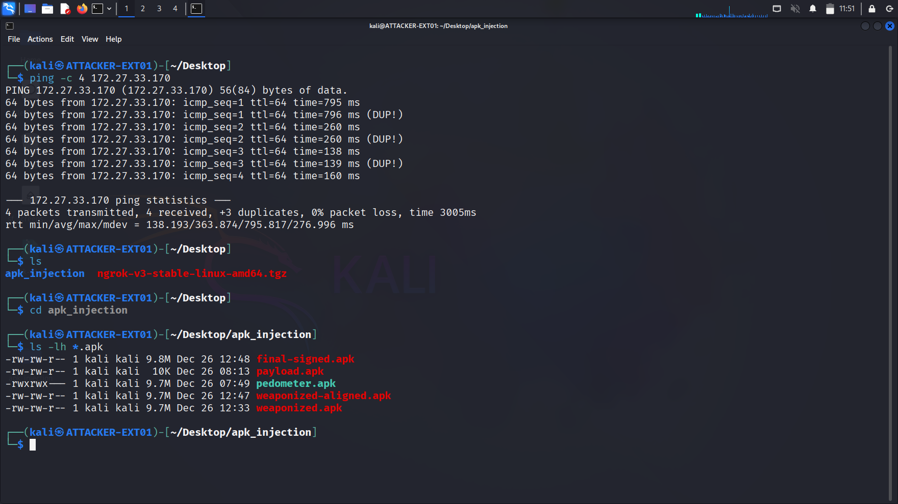
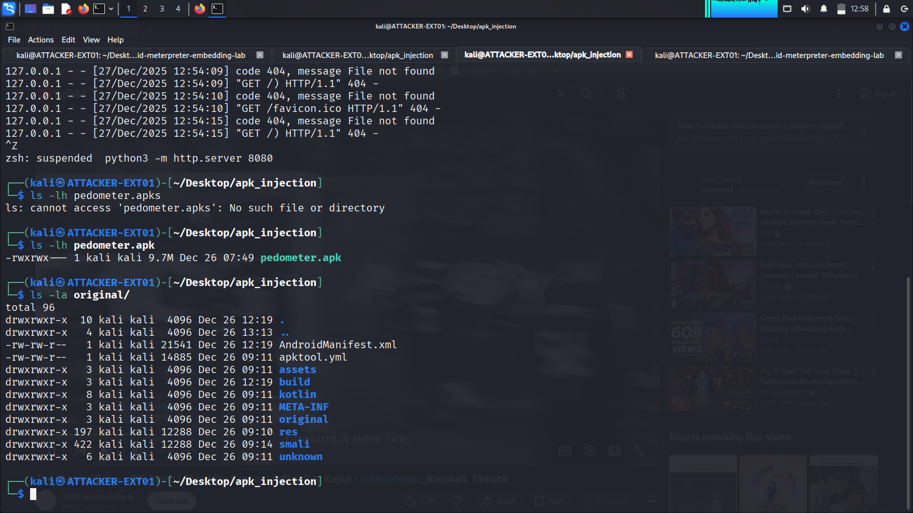

# APK Decompilation

This section documents the process of decompiling both the legitimate Android application and the Meterpreter payload to access their source code structure.

## Project Structure Setup

Created organized workspace for decompilation process:

cd ~/Desktop/apk_injection
ls -la

## Decompiling the Legitimate APK

### Target Application

**App Name:** Pedometer (Step Counter)
**Original APK:** pedometer.apk
**Purpose:** Legitimate fitness tracking application chosen for trojanization

### Decompilation Command

apktool d pedometer.apk -o original

**Parameters:**
- `d` - Decompile mode
- `pedometer.apk` - Source APK file
- `-o original` - Output directory name

### Decompiled Structure

**Key directories created:**
- `AndroidManifest.xml` - App permissions and components
- `smali/` - Dalvik bytecode (decompiled from DEX)
- `res/` - Resources (images, layouts, strings)
- `assets/` - Additional app assets
- `lib/` - Native libraries (if any)

## Decompiling the Payload APK

### Extracting Metasploit Code

apktool d payload.apk -o payload_decoded

**Purpose:** Access the Metasploit smali code that will be injected into the original app.

**Critical folder:**
payload_decoded/smali/com/metasploit/stage/

This contains:
- `Payload.smali` - Core Meterpreter functionality
- `MainActivity.smali` - Entry point for payload execution
- Supporting classes for network communication

## Understanding Smali Code

**Smali** is the human-readable representation of Android's Dalvik bytecode. Key characteristics:
- Assembly-like syntax
- Direct manipulation of Android runtime
- Required for manual code injection

**Example smali instruction:**
invoke-virtual {p0}, Lcom/metasploit/stage/Payload;->start()V

This calls the Meterpreter payload's start method.

## Why Two Decompilations?

**Original App (pedometer.apk):**
- Provides legitimate functionality
- Contains UI and user-facing features
- Will host the hidden payload

**Payload App (payload.apk):**
- Contains Meterpreter backdoor code
- Will be merged into original app
- Runs silently in background

## Verification

After decompilation, verify directory structures:

tree original/ -L 2
tree payload_decoded/smali/com/metasploit -L 2

Both directories must be intact before proceeding to injection phase.

## Personal Notes

*[OPTIONAL: Add your observations here - Did you notice anything interesting in the smali code? Any challenges during decompilation?]*

---

**Next Step:** [04-payload-injection](../04-payload-injection/)
